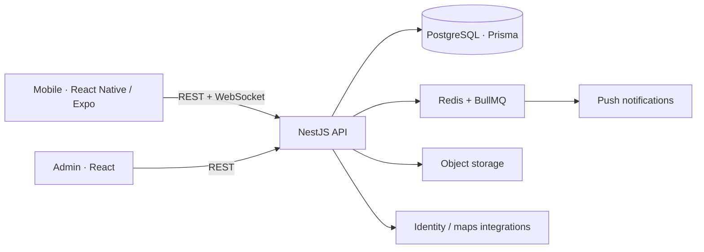

# Padel App — product showcase

> Концепция мобильного сервиса для игры в падел: поиск матчей, бронирование кортов, рейтинг и коммуникации.

## Что решает

Игроку нужно найти партнёров и подходящий корт, а клубу — поддерживать расписание и сообщества без разрозненных чатов и таблиц. Padel App объединяет эти сценарии в одном продукте.

## Возможности MVP

- поиск клубов, кортов и игровых событий;
- бронирование и управление расписанием;
- создание матчей, подтверждение результата и рейтинг;
- чат, уведомления и профили игроков;
- отдельная веб-админка для наполнения клубов и событий.

## Архитектура

## Технологии

`TypeScript` · `React Native` · `Expo` · `React` · `NestJS` · `PostgreSQL` · `Prisma` · `Redis` · `BullMQ` · `WebSocket` · `Docker`

## О репозитории

Это публичная продуктовая витрина. В ней нет production-кода, ключей внешних сервисов, пользовательских данных, конфигурации инфраструктуры или развёртывания.
